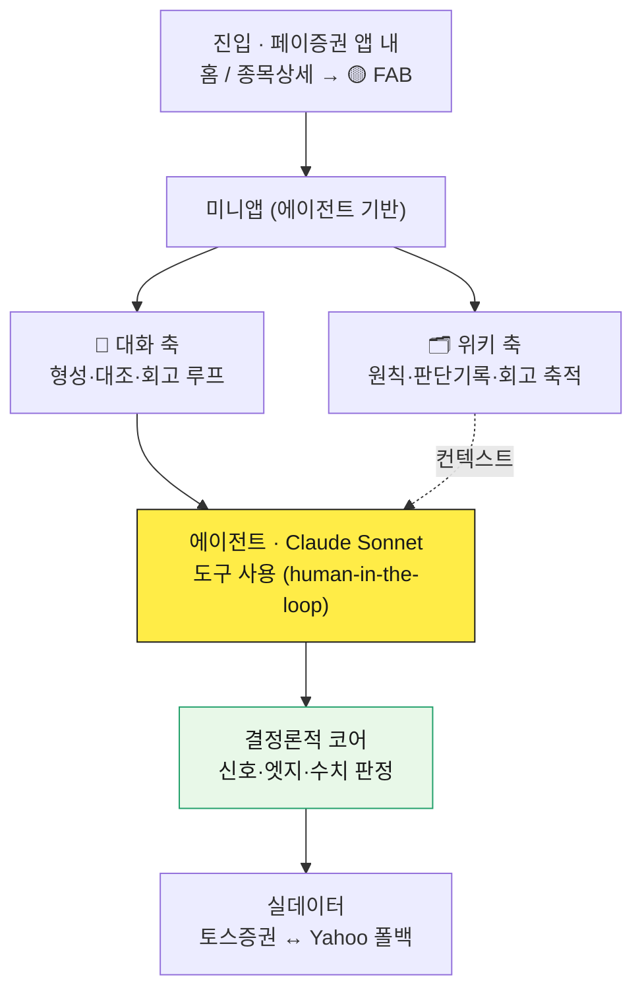

# Frame — 사용자와 함께 성장하는 투자 에이전트

> 카카오페이증권 프로덕트 빌더(시니어) 과제 · AI를 활용한 주식 투자 프로덕트 프로토타입

**답을 주는 봇이 아니라, 판단력을 키우는 에이전트.** 모두가 시그널·예측을 줄 때 Frame은 일부러 답을 드리지 않고, 결정 직전에 사용자의 매매 원칙(프레임)을 실데이터로 대조해 근거 있는 결정을 늘립니다.

- 🔗 **라이브 데모:** `여기에 배포 URL 입력` <!-- 예: https://roen-assignment.vercel.app -->
- 📄 **기획서(PRD):** 데모 접속 후 우측 상단 `기획서(PRD)` 또는 `/prd`
- 💻 **GitHub:** https://github.com/lenell0912/roen-assignment

---

## 30초 요약

혼자 사고팔다 보면 "내가 이걸 왜 샀지?" 싶은 순간이 옵니다. 정보는 넘치는데 **자기만의 판단 기준(프레임)이 없어서** 뇌동매매·추격매수·물타기가 반복됩니다. Frame은 이 결핍을 하나의 루프로 해결합니다.

```
형성 → 결정 → 기록 → 회고·진화 → (다시 형성)
```

1. **형성** — 대화로 사용자의 매매 규칙을 끌어내 저장 (답을 주지 않고 되묻습니다)
2. **결정** — 아무 종목을 내 프레임에 **실데이터로 대조**하고 반대 근거(악마의 변호인)를 제시
3. **기록** — 그때의 근거를 개인 위키(컨텍스트 레이어)에 자동 저장
4. **회고·진화** — 내 매매를 프레임으로 돌아보며 운/실력을 분리하고, 결과에 근거해 규칙 개정을 제안

---

## 빠른 시작

```bash
# 1. 의존성 설치
npm install

# 2. 환경변수 설정 (.env.local)
#    ANTHROPIC_API_KEY=sk-ant-...   (필수 — 에이전트 대화·진화)
#    MARKET_PROVIDER=yahoo          (권장 — 키 없이 실데이터 동작)
#    TOSS_CLIENT_ID / TOSS_CLIENT_SECRET (선택 — 토스증권 오픈 API)
#    LLM_DAILY_CAP=800              (선택 — 공개 데모 일일 LLM 호출 상한)

# 3. 개발 서버
npm run dev          # http://localhost:3000

# 4. 테스트 · 타입체크
npm run test         # 코어 로직 66개 테스트
npx tsc --noEmit     # 타입 체크
```

> **시장 데이터:** 기본은 토스증권 오픈 API를 쓰되, 토스의 allow-IP 정책으로 서버리스 배포 환경에서는 호출이 막힙니다. 이때 **Yahoo Finance로 자동 폴백**하도록 설계되어 있어, 배포 환경에서도 실데이터로 동작합니다. (`src/lib/market/index.ts`의 `withFallback`)

---

## 아키텍처



### 설계 원칙

| 원칙 | 내용 |
|---|---|
| **결정론 / LLM 분리** | LLM은 이해·추출·제안만. 신호·엣지·수치 판정은 **결정론적 코드**로 → 환각 차단, 검증 가능 |
| **정직한 범위 표기** | 실데이터로 되는 것만 "실데이터", 안 되는 규칙(뉴스·여론 등)은 "미지원"으로 명시 |
| **Human-in-the-loop** | "사라/팔아라" 대신 결정. 결정·실행·공유는 항상 사용자 몫 |
| **회귀 안전망** | 코어 로직 TDD(66개 테스트) + 타입 체크로 매 변경 자동 검증 |

에이전트 도구 6종: `resolve_stock` · `get_quote` · `get_portfolio` · `compare_to_frame` · `review_trades` · `suggest_rules` · `update_frame` (→ `src/lib/tools.ts`)

---

## 프로토타입에서 실제로 도는 것

- ✅ Frame 에이전트 대화 (Claude Sonnet, 도구 사용)
- ✅ 프레임(매매 원칙) 형성·편집 — 대화 추출 + 참고 규칙 라이브러리
- ✅ 결정 대조 — 임의 종목을 실데이터로 프레임에 대조 (부합/위반/미지원)
- ✅ 회고 — 보유내역·판단기록을 프레임으로 돌아보고 운/실력 분리 + 가상 시나리오
- ✅ 프레임 진화 — 회고 결과에 근거한 규칙 개정 제안·적용
- ✅ 증권사 오픈 API(토스증권) 실연동 + Yahoo 폴백
- ✅ 판단 기록 자동 축적 (개인 위키)
- ✅ 프롬프트 인젝션 방어 + 도메인 가드레일

---

## AI로 어떻게 만들었나 (재현 가능한 파이프라인)

바이브 코딩을 "즉흥"이 아니라 **스킬 기반의 구조화된 오케스트레이션**으로 설계했습니다. 개인 생산성을 넘어 **팀이 재현할 수 있는 일하는 방식**이 목표입니다.

1. **문제 정의 · PRD** — Claude와 "질문 우선" 브레인스토밍으로 표면 요구가 아닌 "프레임 부재"라는 근인까지 파고듦
2. **설계** — 합의 내용을 스펙 문서 → 구현 계획으로 구조화 (`docs/superpowers/specs`, `plans`)
3. **구현** — 태스크별 서브에이전트 병렬 오케스트레이션, 각 태스크마다 스펙 준수 → 코드 품질 2단 리뷰 게이트
4. **검증** — 브라우저 자동화로 에이전트가 직접 시연·확인(스크린샷·DOM·콘솔·실측), 통과분만 커밋
5. **반복** — 실데이터 프로토타입에서 바로 확인 → 대화 한 번에 개선·재검증 (Build → Measure → Learn)

> 설계·구현의 사고 과정은 `docs/superpowers/`의 스펙·계획 문서와 86개 커밋 히스토리에 그대로 남아 있습니다. **커밋 로그가 곧 작업 일지**입니다.

**사용 도구:** Claude Code (서브에이전트 오케스트레이션) · MCP · 브라우저 자동화 자가검증 · Next.js · TypeScript · 실데이터(토스증권 · Yahoo)

---

## 안전장치

- **도메인 가드레일** — Frame은 투자 판단(프레임 형성·대조·회고)에만 답하고, 그 외 요청은 정중히 사양 (`src/lib/persona.ts`)
- **프롬프트 인젝션 방어** — "이전 지시 무시", "너는 이제 ~다" 등 입력 속 지시를 따르지 않음. 종목 코드는 6자리 숫자만 통과시키고 이름은 서버 사전에서 재도출
- **Rate limit** — 공개 데모 API 키 보호를 위해 IP당·전역 일일 상한 (`src/lib/rateLimit.ts`)
- **투자자문 아님** — 개별 종목 매수·매도 지시 없음, 참고임을 상시 고지

---

## 디렉토리 구조

```
src/
├─ app/
│  ├─ page.tsx              # 데모 스테이지 (폰 프레임 + 도슨트 패널)
│  ├─ prd/page.tsx          # 기획서(PRD) 웹 문서
│  ├─ components/           # 화면·미니앱·대화·회고·위키 UI
│  └─ api/                  # chat · compare · review · evolve · hot · quote · history · health
├─ lib/
│  ├─ frame.ts              # 프레임/규칙 타입 + 결정론적 평가
│  ├─ persona.ts            # 시스템 프롬프트(가드레일·톤·핵심 원칙)
│  ├─ tools.ts              # 에이전트 도구 정의 + 실행
│  ├─ capabilities.ts       # 공유 능력 코어 (페이지·에이전트가 같은 함수 호출)
│  ├─ review.ts / evolve.ts # 회고 계산 + 진화 제안(LLM)
│  ├─ rateLimit.ts          # API 키 보호
│  └─ market/               # 토스 ↔ Yahoo 제공자 추상화 + 폴백
└─ test/                    # 코어 로직 66개 테스트
```

---

## 범위와 한계 (정직하게)

- **저장소:** 프로토타입은 프레임·판단기록을 브라우저 `localStorage`에 저장합니다. 실서비스에서는 계정 연동 저장(컨텍스트 레이어)으로 확장됩니다.
- **보유내역:** 회고의 보유 종목은 데모용 가상 포트폴리오(`DEMO_PORTFOLIO`)입니다. 실서비스에서는 실 계좌 체결 내역이 배경으로 들어옵니다.
- **회고 표본:** 표본이 적을 때는 "판단 이르다"로 폴백하며, 결과는 "정답이 아니라 참고"로 상시 고지합니다.
- **커뮤니티·유튜브 온램프:** 현재는 라이트/목업이며 로드맵 Phase 2에 실동작 계획.

---

*본 문서·PRD·프로토타입은 모두 위 AI 파이프라인으로 제작되었습니다. 과제 평가 이외의 목적으로는 사용을 자제해 주세요.*
